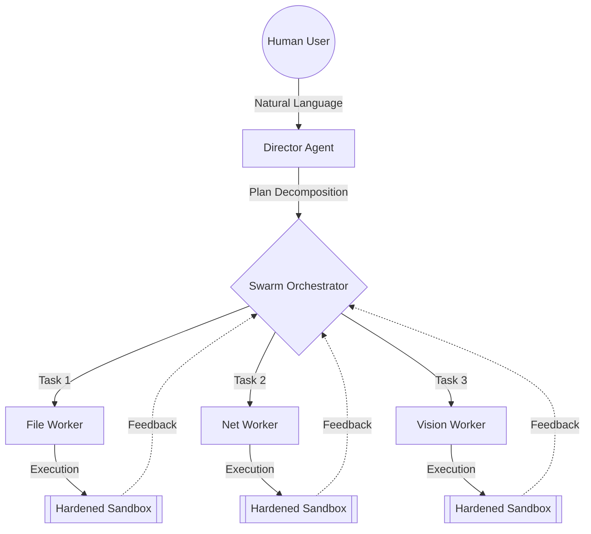

# 🌌 Aether Desktop Agent (ADA)
> **The First Truly Autonomous, Swarm-Powered OS Intelligence.**

[**简体中文版入口 (Chinese Version)**](./README_ZH.md)

---

## 🛰️ Project Overview

**Aether Desktop Agent (ADA)** is not just another LLM wrapper. It is a distributed, autonomous orchestration engine designed to transform your operating system into a self-evolving workspace. By leveraging a unique **Director-Worker Swarm Architecture**, ADA decomposes complex human intent into actionable sub-tasks, executing them across sandboxed environments with surgical precision.

### 🧠 The Core Philosophy
ADA operates on the principle of **Cognitive Delegation**. Instead of providing simple answers, ADA provides *results*. Whether it's managing a complex software project, conducting deep web research, or orchestrating multi-device workflows, ADA handles the cognitive load so you can focus on the vision.

---

## 🔥 Key Capabilities

### 🐝 Swarm Orchestration
ADA utilizes a sophisticated **Hierarchical Planning Engine**. A high-intelligence "Director" model breaks down goals, while a fleet of specialized "Worker" agents execute them in parallel.
- **Dynamic Load Balancing**: Tasks are routed to the most efficient model based on complexity.
- **Real-time HUD**: Visualize your swarm's progress through a node-based orchestration map.

### 👁️ Multimodal Perception (Vision Hub)
With the **Vision Hub**, ADA "sees" your desktop like a human does.
- **Visual Grounding**: Identify UI elements, buttons, and text fields with 99% accuracy.
- **OCR Pipeline**: Real-time text extraction for seamless data migration between legacy apps.

### 🛡️ Hardware-Level Security
Your data stays yours. ADA implements a multi-layered security stack:
- **Process Isolation**: All tool executions happen in hardened, ephemeral sandboxes.
- **Identity Vault**: AES-256 encrypted storage for your API keys and credentials.
- **Audit Trace**: Every action taken by the agent is logged and replayable for full transparency.

### 🌐 P2P Mesh Collaboration (Swarm Link)
ADA can find other ADA instances on your local network to create a **P2P Swarm**, sharing compute resources and context to solve planetary-scale problems on your desktop.

---

## 🛠️ Technical Excellence

- **Core**: High-performance Rust engine for low-latency orchestration.
- **Frontend**: Ultra-premium Glassmorphism UI built with React & Framer Motion.
- **Intelligence**: Agnostic model support (GPT-4o, Claude 3.5, Local Llama 3 via Ollama).

---

## 🚀 Quick Start

1. **Download**: Grab the latest `ADA-Installer.exe` from the [Releases](https://github.com/xa88/Aether-Desktop-Agent/releases) page.
2. **Install**: Follow the wizard (includes automated environment setup).
3. **Configure**: Enter your AI provider keys in the **Identity Vault**.
4. **Deploy**: Type your first goal into the Chat interface and watch the swarm begin.

---

## 🗺️ The Path Ahead (2026)
- [ ] **Neural Synapse**: Direct brain-computer interface integration research.
- [ ] **Global Swarm**: Encrypted P2P clusters over the public internet.
- [ ] **Self-Evolution**: Automated self-patching and tool-augmentation based on user behavior.

---

## ⚖️ License
Distributed under the **GNU General Public License v3.0**. See `LICENSE` for more information.

---

  Built with ❤️ by the Aether Team.

