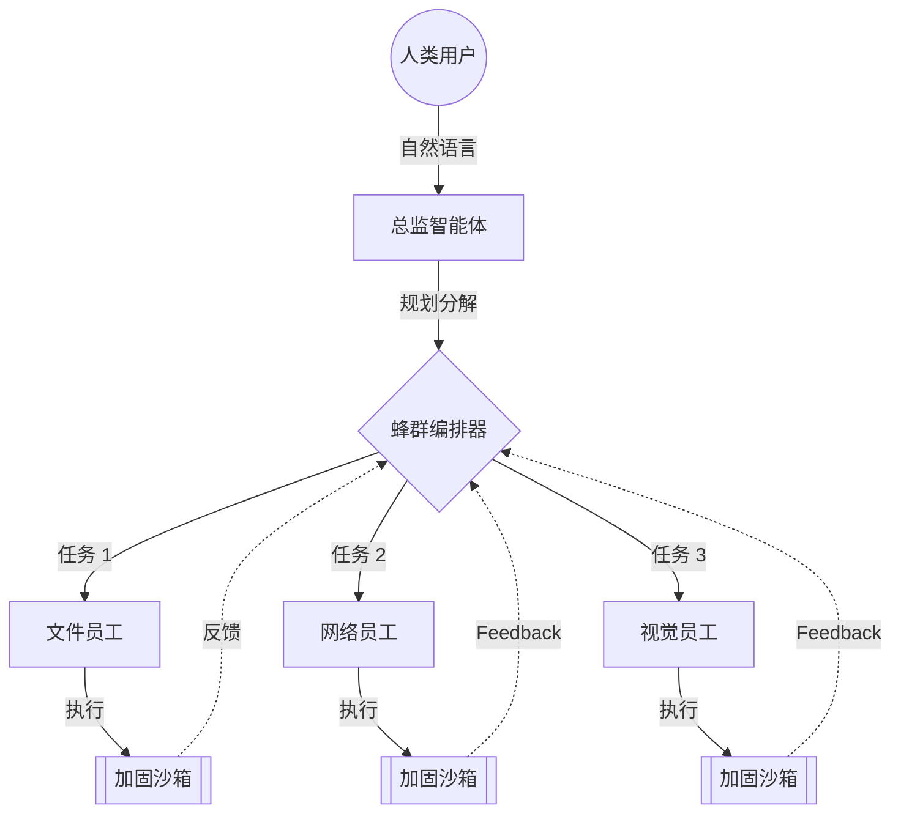

# 🌌 Aether Desktop Agent (ADA)
> **全球首款真正意义上的自主、蜂群驱动型 OS 智能体。**

[**English Version Entrance**](./README.md)

---

## 🛰️ 项目概览

**Aether Desktop Agent (ADA)** 不仅仅是一个简单的 LLM（大语言模型）封装工具。它是一个分布式的自主编排引擎，旨在将您的操作系统转化为一个能够自我演进的智能工作空间。通过 ADA 独特的 **“总监-员工”蜂群架构 (Director-Worker Swarm Architecture)**，它能将复杂的人类意图分解为可执行的子任务，并在沙箱环境中精准执行。

### 🧠 核心理念
ADA 遵循 **“认知委托” (Cognitive Delegation)** 原则。它不只是提供回答，而是直接交付“结果”。无论是管理复杂的软件项目、进行深度网络调研，还是协调多设备工作流，ADA 都能为您承担认知压力，让您专注于愿景本身。

---

## 🔥 核心能力

### 🐝 蜂群编排 (Swarm Orchestration)
ADA 使用尖端的 **分层规划引擎**。高智能的“总监”模型负责拆解目标，而一组专门的“员工”智能体则并行执行任务。
- **动态负载均衡**：根据任务复杂度实时调整模型路由，确保最高效率。
- **实时可视化 HUD**：通过节点式编排地图，实时掌握您的蜂群进度。

### 👁️ 多模态感知 (Vision Hub)
借助 **Vision Hub**，ADA 能够像人类一样“看见”并理解您的桌面。
- **视觉锚点定位 (Visual Grounding)**：以 99% 的准确率识别 UI 元素、按钮和文本框。
- **OCR 流水线**：实时提取文本，实现旧版应用之间的数据无缝迁移。

### 🛡️ 硬件级安全保障
您的数据永远属于您。ADA 实现了多层安全栈：
- **进程隔离**：所有工具执行均在加固的、即用即弃的沙箱中进行。
- **身份金库 (Identity Vault)**：使用 AES-256 加密存储您的 API 密钥和凭据。
- **审计追踪**：智能体的每一项操作均可记录并回放，确保完全透明。

### 🌐 P2P 网格协作 (Swarm Link)
ADA 可在局域网内自动发现其他 ADA 实例，构建 **P2P 蜂群**，共享计算资源和上下文，直接在您的桌面上解决行星规模的任务。

---

## 🛠️ 技术优势

- **核心引擎**：高性能 Rust 引擎，实现低延迟编排。
- **前端界面**：基于 React 和 Framer Motion 构建的极致毛玻璃感 (Glassmorphism) UI。
- **智能驱动**：支持多种模型（GPT-4o, Claude 3.5, 或通过 Ollama 部署本地模型）。

---

## 🚀 快速开始

1. **下载**：在 [Releases](https://github.com/xa88/Aether-Desktop-Agent/releases) 页面获取最新的 `ADA-Installer.exe`。
2. **安装**：按照向导操作（包含自动化的环境配置）。
3. **配置**：在 **身份金库 (Identity Vault)** 中输入您的 AI 服务商密钥。
4. **部署**：在聊天界面输入您的第一个目标，观察蜂群开始运作。

---

## 🗺️ 未来蓝图 (2026)
- [ ] **神经触突 (Neural Synapse)**：直接脑机接口集成研究。
- [ ] **全球蜂群 (Global Swarm)**：通过公网构建加密的 P2P 集群。
- [ ] **自我演进 (Self-Evolution)**：根据用户行为实现自动补丁和工具增强。

---

## ⚖️ 开源协议
本项目采用 **GNU General Public License v3.0**。更多详情请参阅 `LICENSE` 文件。

---

  由 Aether 团队倾情打造 ❤️

